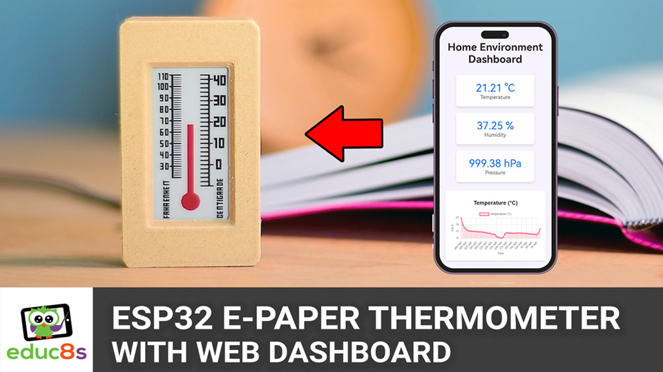

# ESP32-Powered E-Paper Home Environment Dashboard

## Overview
This project blends electronics with design to create a vintage-style thermometer powered by an ESP32 microcontroller and a tri-color E-paper display. While resembling a classic analog thermometer, it also features a modern web-based dashboard for real-time monitoring of temperature, humidity, and pressure. 

The case is 3D-printed using wood filament, giving it an authentic vintage look, and the real-time dashboard allows for local data storage and privacy-focused environmental tracking.

## Features
- **Elegant E-Paper Display:** Low power consumption and excellent readability.
- **Web-Based Dashboard:** Monitor temperature, humidity, and barometric pressure in real time.
- **Local Data Storage:** No cloud dependence, ensuring full privacy.
- **48-Hour Logging:** View historical trends for environmental monitoring.
- **Minimal Wiring:** Just four simple connections.
- **Custom 3D-Printed Case:** Vintage-inspired design with a practical USB breakout for easy power access.

## Video Tutorial

🎥 [Watch the Full Video Tutorial](https://youtu.be/eyifLGnNtt4)

## Parts List
Here are the components you need for this build:

| Component | Description | Buy Link |
|-----------|-------------|---------|
| **Inkplate2** | E-Paper display board from Soldered | [Buy Here](https://educ8s.tv/part/Inkplate2) |
| **BME280** | Sensor for temperature, humidity, and barometric pressure | [Buy Here](https://educ8s.tv/part/BME280) |
| **MicroUSB Breakout** | Power and programming access | [Buy Here](https://educ8s.tv/part/MiniUSBBreakout) |

## Circuit Diagram
The wiring for this project is extremely simple:
- **BME280 Sensor → Inkplate2 Board**
  - VCC → 3.3V
  - GND → GND
  - SCL → SCL
  - SDA → SDA

## Software Setup
To compile and upload the project, install the following libraries in the Arduino IDE:
- **Inkplate Library** (for the E-paper display)
- **Adafruit BME280 Library** (for the sensor)
- **ArduinoJson Library** (for handling JSON data)

### Code Structure
The project follows an object-oriented programming approach for better maintainability:
- **`Sensor.cpp` & `Sensor.h`** – Handles sensor readings.
- **`SensorData.cpp` & `SensorData.h`** – Stores and manages historical data.
- **`Display.cpp` & `Display.h`** – Manages rendering data on the E-paper display.
- **`index_html.h`** – Hosts the web-based dashboard.
- **`ESP32_HomeDashboard.ino`** – Main program logic, handling updates and communication.

## Web Dashboard
The built-in web server displays live and historical data with intuitive graphs. Simply access the device's local IP in a browser to view:
- **Current Temperature, Humidity, and Pressure**
- **Graphs of the last 48 hours' data**
- **Automatic unit switching between Celsius and Fahrenheit**

## Power Consumption & Optimization
This project is designed to remain plugged in, but some power-saving measures are included:
- The E-Paper display updates only when necessary.
- Historical data is updated every 5 minutes.
- Running the web server increases power consumption to ~1200mAh/day.

For battery operation, consider disabling the web server and optimizing sleep modes.

## 3D-Printed Enclosure
The 3D-printed case is designed for aesthetics and functionality. The following modifications improve usability:
- **Sensor Exposure:** Cutout at the back ensures accurate readings.
- **USB Breakout Access:** Allows for easier power connection.
- **Stable Stand:** Adjusted port positioning for an upright display.

You can find the 3D model files [here](https://your_link_to_files).

## How to Use
1. Flash the firmware to the ESP32 board.
2. Edit `ESP32_HomeDashboard.ino` to enter your WiFi credentials.
3. Upload the code and reboot the board.
4. Find the device's IP address in the serial monitor and access it via a web browser.

## Future Improvements
- **Battery Optimization:** Reduce power consumption for months-long operation.
- **Mobile App Integration:** Use MQTT or Bluetooth for enhanced connectivity.
- **More Sensors:** Expand the project with additional environmental tracking features.

---

## License & Open Source Contribution
This project is fully open source, and contributions are welcome! Feel free to expand the functionality and share your modifications.

🛠 Built by [Nick Koumaris](https://www.educ8s.tv)
📺 Follow me on [YouTube](https://www.youtube.com/educ8s) for more projects!

